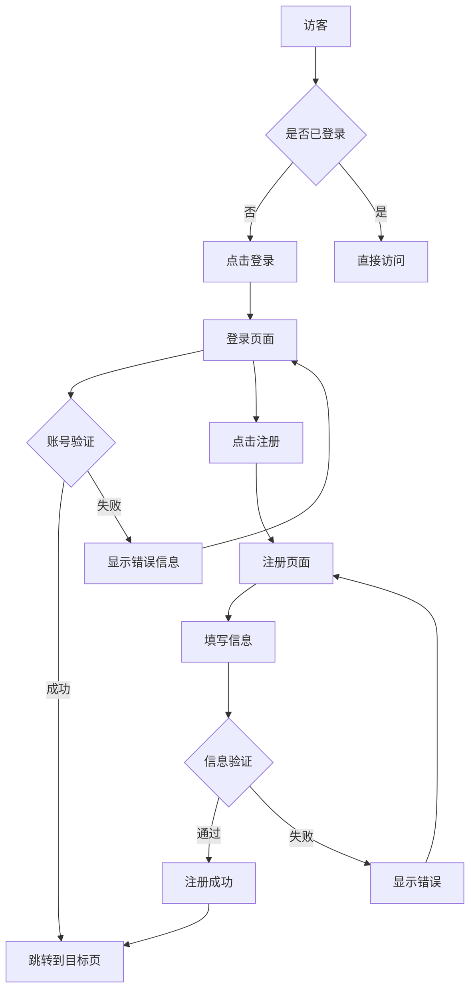
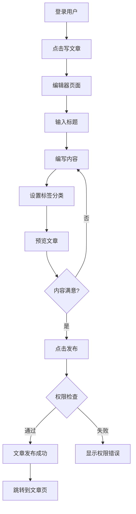

# 现代化博客系统 - 用户体验设计

## 🎨 设计理念

### 核心设计原则
- **简洁优雅**: 清爽的界面设计，突出内容本身
- **响应式**: 完美适配桌面、平板、手机各种设备
- **易用性**: 直观的操作流程，降低学习成本
- **可访问性**: 支持键盘导航和屏幕阅读器

## 📱 界面原型设计

### 1. 首页布局
```
┌─────────────────────────────────────────┐
│ [Logo] [导航菜单]              [搜索] [登录] │
├─────────────────────────────────────────┤
│                                         │
│  🎯 热门文章推荐区                        │
│  ┌───────┐ ┌───────┐ ┌───────┐          │
│  │文章1  │ │文章2  │ │文章3  │          │
│  │封面图 │ │封面图 │ │封面图 │          │
│  └───────┘ └───────┘ └───────┘          │
│                                         │
│  📝 最新文章列表                         │
│  ┌─────────────────────────────────┐     │
│  │ 📄 文章标题1                     │     │
│  │ 👤 作者 📅 日期 🏷️ 标签         │     │
│  │ 📝 文章摘要...                  │     │
│  └─────────────────────────────────┘     │
│                                         │
│  📋 侧边栏                              │
│  - 分类导航                             │
│  - 标签云                               │
│  - 热门文章                             │
│                                         │
└─────────────────────────────────────────┘
```

### 2. 文章详情页
```
┌─────────────────────────────────────────┐
│ [导航栏]                                 │
├─────────────────────────────────────────┤
│                                         │
│  📄 文章标题                             │
│  👤 作者信息 📅 发布时间 👁️ 阅读量        │
│  🏷️ 标签1 标签2 标签3                   │
│                                         │
│  ────────────────────────────           │
│                                         │
│  📝 文章正文内容                         │
│      支持 Markdown 渲染                 │
│      代码高亮                           │
│      图片展示                           │
│                                         │
│  ────────────────────────────           │
│                                         │
│  👍 点赞 📤 分享 🔖 收藏                │
│                                         │
│  💬 评论区                              │
│  ┌─────────────────────────────────┐     │
│  │ 👤 用户1: 很不错的文章！         │     │
│  │ 👤 用户2: 学到了很多            │     │
│  └─────────────────────────────────┘     │
│                                         │
│  ✍️ 发表评论                            │
│  [文本框]                  [提交]       │
│                                         │
└─────────────────────────────────────────┘
```

### 3. 写作页面
```
┌─────────────────────────────────────────┐
│ [保存] [预览] [发布]               [设置] │
├─────────────────────────────────────────┤
│                                         │
│  📝 标题输入框                           │
│  ┌─────────────────────────────────┐     │
│  │ 请输入文章标题...               │     │
│  └─────────────────────────────────┘     │
│                                         │
│  ┌─────────────┬─────────────────────┐   │
│  │ Markdown    │ 实时预览              │   │
│  │ 编辑器      │                     │   │
│  │             │ 渲染后的内容         │   │
│  │ # 标题      │                     │   │
│  │ 正文...     │ 标题                │   │
│  │             │ 正文...             │   │
│  │             │                     │   │
│  └─────────────┴─────────────────────┘   │
│                                         │
│  🏷️ 标签: [标签1] [标签2] [+添加]       │
│  📂 分类: [下拉选择]                     │
│  🖼️ 封面图: [上传图片]                   │
│                                         │
└─────────────────────────────────────────┘
```

### 4. 管理后台
```
┌─────────────────────────────────────────┐
│ [Logo] 博客管理后台              [用户] │
├─────┬───────────────────────────────────┤
│ 📊  │ 📈 数据概览                       │
│ 概览│ ┌───────┐ ┌───────┐ ┌───────┐     │
│     │ │总文章 │ │总用户 │ │总访问 │     │
│ 📝  │ │ 1,234 │ │  567  │ │98,765 │     │
│ 文章│ └───────┘ └───────┘ └───────┘     │
│     │                                 │
│ 👥  │ 📋 最新文章列表                   │
│ 用户│ ┌─────────────────────────────┐   │
│     │ │ ✏️ 文章1 👤 作者 📅 日期    │   │
│ 💬  │ │ ✏️ 文章2 👤 作者 📅 日期    │   │
│ 评论│ │ ✏️ 文章3 👤 作者 📅 日期    │   │
│     │ └─────────────────────────────┘   │
│ ⚙️  │                                 │
│ 设置│ 📊 访问统计图表                   │
│     │ [图表展示]                       │
└─────┴───────────────────────────────────┘
```

## 🎯 交互流程设计

### 用户注册登录流程


### 文章发布流程


## 🎨 视觉设计规范

### 色彩方案
```css
:root {
  /* 主色调 */
  --primary-color: #3b82f6;      /* 蓝色 - 主要按钮、链接 */
  --secondary-color: #10b981;    /* 绿色 - 成功状态 */
  --accent-color: #f59e0b;       /* 橙色 - 警告、强调 */
  
  /* 中性色 */
  --text-primary: #1f2937;       /* 深灰 - 主要文字 */
  --text-secondary: #6b7280;     /* 中灰 - 次要文字 */
  --background: #ffffff;         /* 白色 - 背景 */
  --surface: #f9fafb;           /* 浅灰 - 卡片背景 */
  --border: #e5e7eb;            /* 边框色 */
  
  /* 状态色 */
  --success: #10b981;           /* 成功 */
  --warning: #f59e0b;           /* 警告 */
  --error: #ef4444;             /* 错误 */
  --info: #3b82f6;              /* 信息 */
}
```

### 字体规范
```css
/* 字体族 */
font-family: 
  -apple-system, BlinkMacSystemFont, 
  "Segoe UI", Roboto, "Helvetica Neue", 
  Arial, "Noto Sans", sans-serif;

/* 字体大小 */
--font-xs: 0.75rem;     /* 12px - 小标签 */
--font-sm: 0.875rem;    /* 14px - 次要文字 */
--font-base: 1rem;      /* 16px - 正文 */
--font-lg: 1.125rem;    /* 18px - 小标题 */
--font-xl: 1.25rem;     /* 20px - 标题 */
--font-2xl: 1.5rem;     /* 24px - 大标题 */
--font-3xl: 1.875rem;   /* 30px - 页面标题 */
```

### 间距规范
```css
/* 间距系统 (基于 4px) */
--space-1: 0.25rem;     /* 4px */
--space-2: 0.5rem;      /* 8px */
--space-3: 0.75rem;     /* 12px */
--space-4: 1rem;        /* 16px */
--space-6: 1.5rem;      /* 24px */
--space-8: 2rem;        /* 32px */
--space-12: 3rem;       /* 48px */
--space-16: 4rem;       /* 64px */
```

## 📱 响应式设计

### 断点设置
```css
/* 移动端优先 */
@media (min-width: 640px)  { /* sm: 平板竖屏 */ }
@media (min-width: 768px)  { /* md: 平板横屏 */ }
@media (min-width: 1024px) { /* lg: 小屏笔记本 */ }
@media (min-width: 1280px) { /* xl: 大屏显示器 */ }
```

### 自适应布局
- **移动端**: 单列布局，隐藏侧边栏
- **平板**: 两列布局，可收缩侧边栏  
- **桌面**: 三列布局，固定侧边栏

## ✨ 动效设计

### 微交互
```css
/* 悬停效果 */
.button:hover {
  transform: translateY(-1px);
  box-shadow: 0 4px 12px rgba(0,0,0,0.15);
  transition: all 0.2s ease;
}

/* 页面切换 */
.page-transition {
  opacity: 0;
  transform: translateY(20px);
  animation: fadeInUp 0.3s ease forwards;
}

/* 加载动画 */
.loading {
  animation: pulse 1.5s ease-in-out infinite;
}
```

## 🔧 可用性优化

### 无障碍访问
- 键盘导航支持
- 屏幕阅读器友好
- 高对比度模式
- 字体大小调节

### 性能优化
- 图片懒加载
- 代码分割
- 服务端渲染
- CDN 加速

---

## 🎯 设计交付物

1. **设计规范文档** ✅
2. **原型交互图**
3. **视觉设计稿**
4. **响应式适配方案**
5. **动效设计说明** 